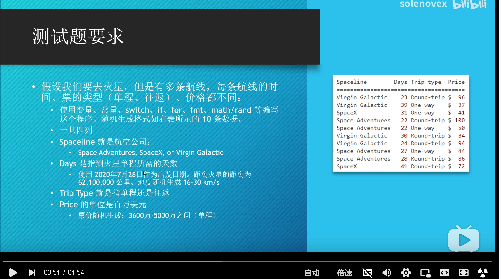
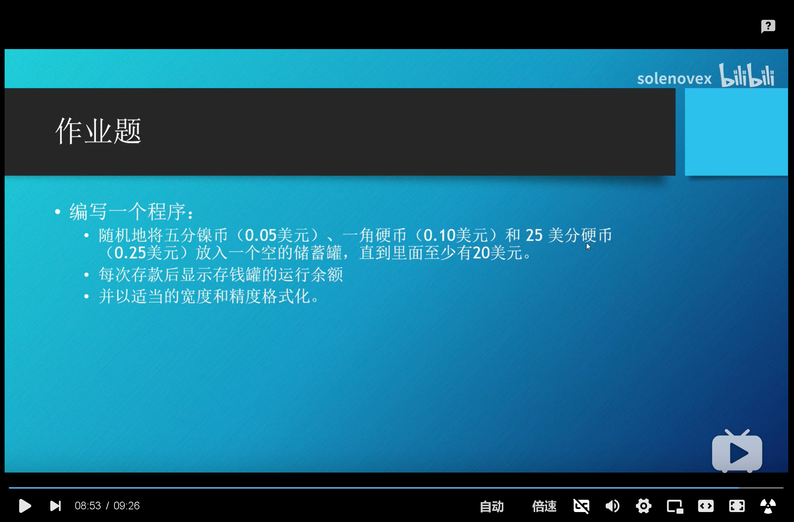
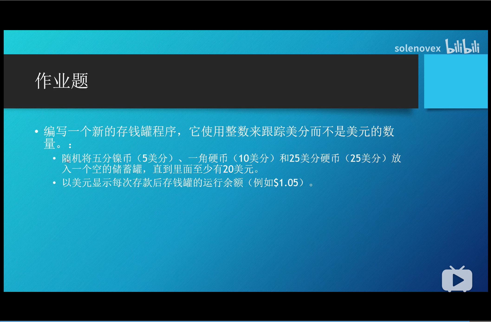
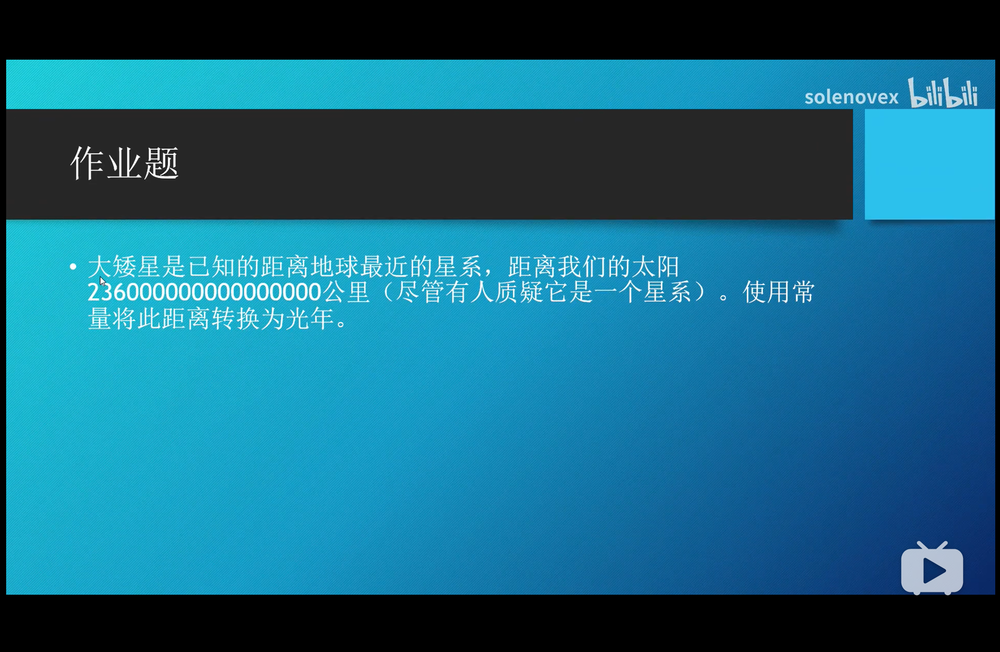
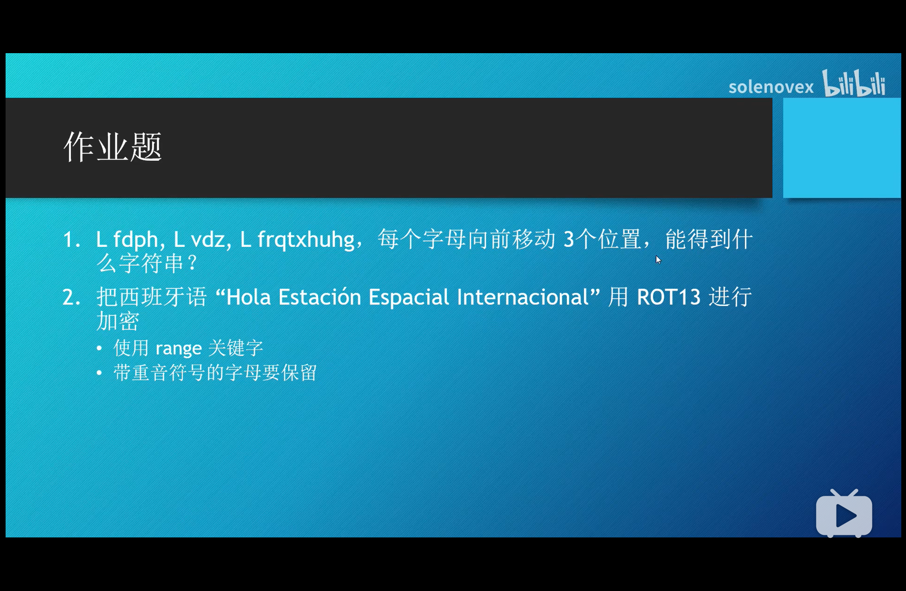
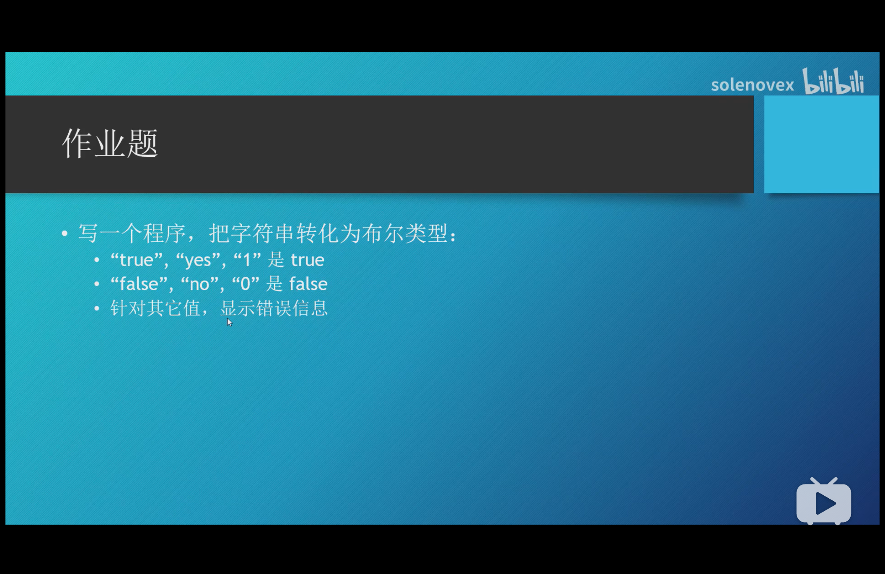
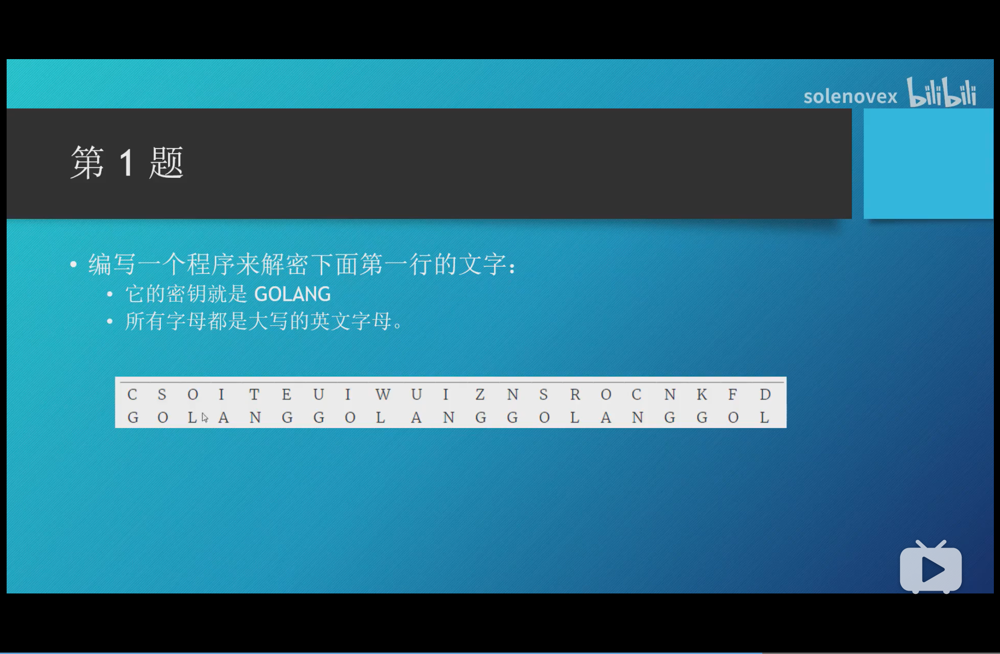
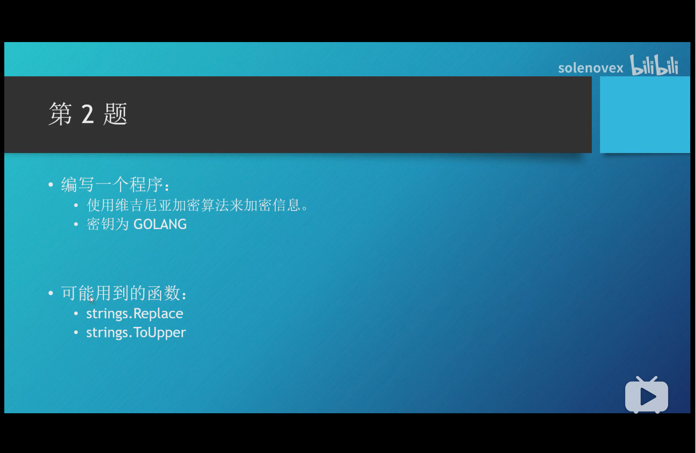
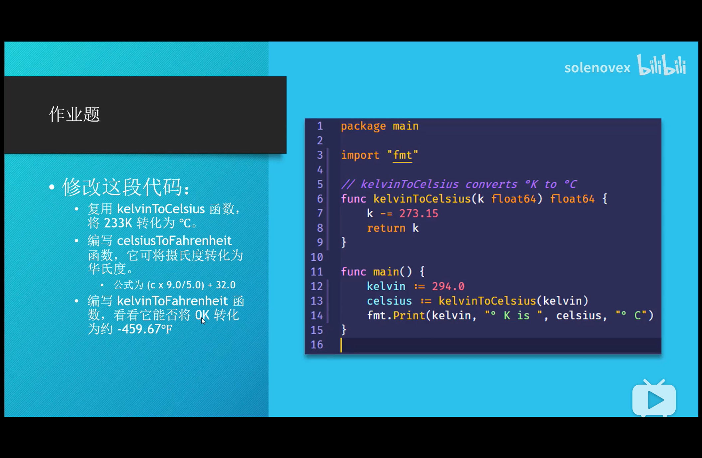
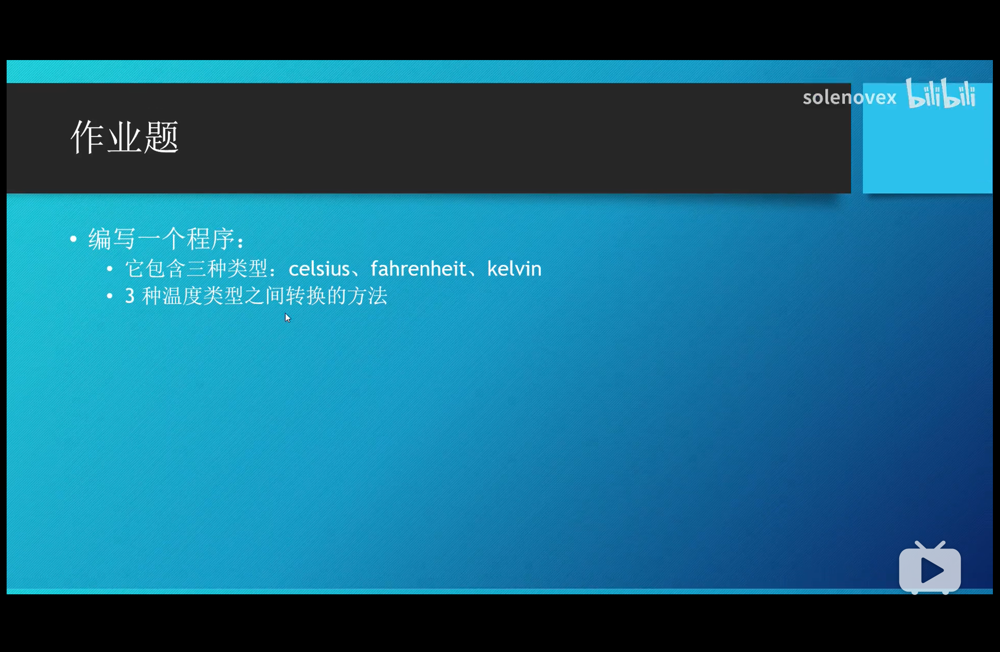

# golang-demo-code
用于学习go语言的记录

# Hello world
我的第一句`go`代码，[详情](./main.go)

# 算术运算、变量、常量、打印

- 算术运算

  ```go
  const num8 = 123
  const num9 = num8 * 11.0
  const num10 = num9 / 1.7
  fmt.Println(num10)
  ```
- 变量

  ```go
  // 单个变量
  var num = 123
  fmt.Println(num)
  // 多个变量 第一种
  var num1, num2 = 123, 456
  fmt.Println(num1, num2)

  // 第二种
  var (
    num3 = 123
    num4 = 456
  )
  fmt.Println(num3, num4)
  ```
- 常量

  ```go
  const num7 = 123
  fmt.Println(num7)
  ```
- 打印

  打印是通过`"fmt"`包来打印的，主要打印方法:`Printf`、`Println`、`Print`。
  
  * Printf：带有格式化参数输出
  * Println：自带换行输出
  * Print：直接输出
  ```go
  // 输出格式化
  // 6位长度，左边补空格
  fmt.Printf("%6v\n", num1)
  // 负数右补齐
  fmt.Printf("%-6v %3v\n", num1, num2)
  ```
  > %v占位符，负数-右填充，正数-左填充

[代码详情](./mars.go)

# 循环和分支
循环和分支和其他语言大同小异。需要注意的是`go`中没有**while**循环语句。

练习代码[详见](./iffor.go)

# 变量和作用域
这里的*变量*主要是引入一种 **短声明方式(:=)** 定义变量。作用域有过其他语言经验也很好理解，这里特定说明一下`package`变量作用域。

练习代码[详见](./scope.go)

# go05部分习题



答案：[习题答案](./go05.go)

# 实数（浮点数）

浮点数相关的注意事项都在demo中有所体现。

练习代码[详见](./go06.go)

**作业题：**



[答案](./go06.go)

# 整数

练习代码[详见](./go07.go)

**作业题**


答案：[习题答案](./go07.go)

# 大数（math/big）

练习代码[详见](./go08.go)

**作业题**


答案：[习题答案](./go08.go)

# 字符串

练习代码[详见](./go09.go)

**作业题**


答案：[习题答案](./go09.go)

# 类型转换

练习代码[详见](./go10.go)

**作业题**


答案：[习题答案](./go10.go)

# 第二部分作业题

**作业题①**



**作业题②**



# 函数

练习代码[详见](./go12.go)

**作业题**


答案：[习题答案](./go12.go)

# 方法

- 在C#、Java里，方法属于类
- 在Go里，它提供了方法，但是没提供类和对象
- Go比其他语言的方法要灵活

>`方法`是可以将方法与同包中声明的任何类型相关联，但不可以是int\float64等预声明的类型进行**关联**

练习代码[详见](./go13.go)

**作业题**


答案：[习题答案](./go13.go)
